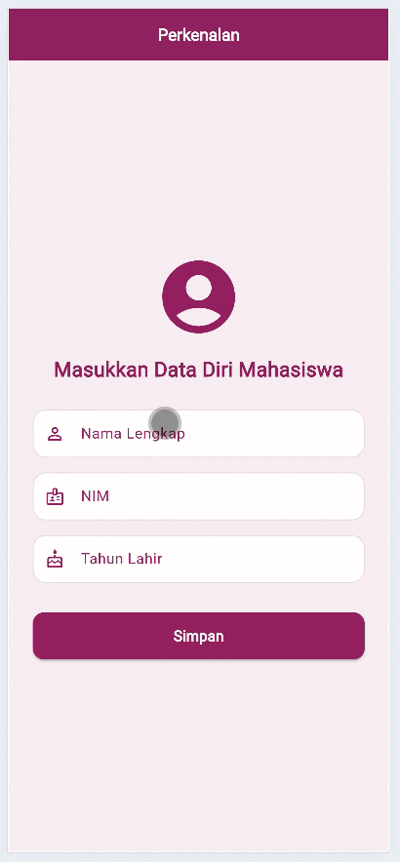

# Tugas 6 Flutter - Passing Data antar Halaman

## Identitas
Dyah Ghaniya Putri  
H1D023022 
Praktikum Pemrograman Mobile  
Shift F/A

---

## Tentang Aplikasi
Aplikasi ini dibuat untuk memenuhi Tugas 6 Praktikum Pemrograman Mobile. Fungsinya untuk menampilkan cara pengiriman data (passing data) antar halaman menggunakan Flutter.  

Terdapat dua halaman utama:
1. **form_data.dart** yaitu halaman input berisi nama, NIM, dan tahun lahir.  
2. **tampil_data.dart** yaitu halaman hasil yang menampilkan data yang sudah diinput beserta umurnya.

---

## Fitur Aplikasi
- Input data: nama, NIM, dan tahun lahir.  
- Validasi input agar tidak kosong.  
- Hitung otomatis umur berdasarkan tahun lahir.  
- Tampilkan hasil dalam tampilan card rapi.  
- Tombol kembali ke halaman form.

---

## Proses Passing Data
1. Data diambil dari `TextEditingController`.  
2. Data dikirim ke halaman lain dengan `Navigator.push()` dan konstruktor class.  
3. Halaman tujuan menerima data melalui parameter konstruktor dan menampilkannya.

### Pengiriman Data
```dart
Navigator.push(
  context,
  MaterialPageRoute(
    builder: (context) => TampilDataPage(
      nama: nama,
      nim: nim,
      umur: umur,
    ),
  ),
);
```

### Penerimaan Data
```dart
final String nama;
final String nim;
final int umur;

const TampilDataPage({
  required this.nama,
  required this.nim,
  required this.umur,
});
```

---

### Demo Aplikasi


---

### Kesimpulan
Aplikasi ini menunjukkan cara sederhana untuk melakukan passing data antar halaman di Flutter dengan memanfaatkan Navigator.push() dan konstruktor class. Dengan cara ini, data dari form dapat dikirim ke halaman hasil dan ditampilkan kembali secara efisien serta mudah dipahami.